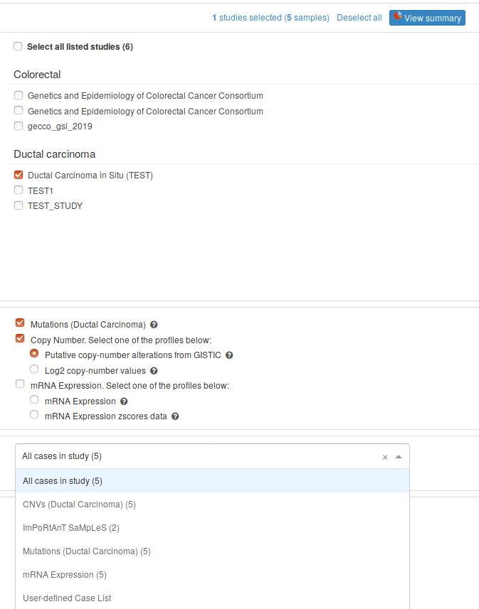

# CASE LIST Config
This is the specification for the `CASE_LIST` study config files.

This file follows the [standard format](STUDY_CONFIG.md).

### Configuring your data
To add this type of data to the study, gather the set of `SAMPLE_ID`s that you feel are relevant.

### Configuring your header

The minimal header will look like this:
```
#suffix=_<whatever>
#profile_name=ImPoRtAnT SaMpLeS
#profile_description=A Particular subset of the samples believed to be important
```
All key-value pairs **above** are **required**.

### Configuring DataFrame

The DataFrame of the `CASE_LIST` Config must contain just 1 column:

```
SAMPLE_ID
```

Note that `SAMPLE_ID` will show up in cBioPortal. Therefore `SAMPLE_ID` must match that seen in [PATIENT_AND_SAMPLE_CONFIG.txt](PATIENT_AND_SAMPLE_CONFIG.md).

## Adding Expression Data

To add **Expression Data** you need to add the key `CASE_LIST` with the relative path to the expression config file to the [STUDY_CONFIG.txt](STUDY_CONFIG.md). 

Like this:

```
CASE_LIST	weird_list.txt
CASE_LIST	interesting_list.txt
```
The file `expression.txt` would look like:

```
#suffix=_merp
#profile_name=ImPoRtAnT SaMpLeS
#profile_description=A Particular subset of the samples believed to be important
SAMPLE_ID
TEST_0002_Br_P_EX_1
TEST_0004_Br_P_EX_1
```

The case lists will appear here:

